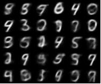

# variational-autoencoder

Implementation of a variational autoencoder model for image generation.
Currently the model is in testing phase and runs only on the MNIST dataset.
In the future, the model will be expanded and optimized for larger and more complicated images.

The following numbers were created after ~ 18,000 training steps:

Much inspiration for the code was taken from:

* hwalsuklee: [tensorflow-generative-model-collection](https://github.com/hwalsuklee/tensorflow-generative-model-collections)
* Felix Mohr: [VAE tutorial](https://github.com/FelixMohr/Deep-learning-with-Python/blob/master/VAE.ipynb)

